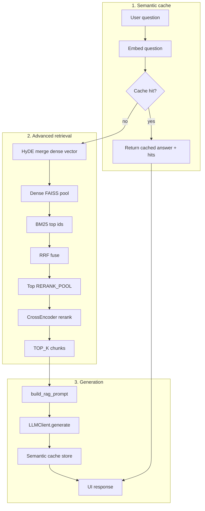

# Advanced RAG pipeline (implemented)

This document describes **Phase 2 — Advanced RAG** in [phase-roadmap.md](phase-roadmap.md). **This repository always runs this stack** (no feature flags): semantic cache lookup → HyDE-augmented dense vector → dense candidate pool → **BM25** → **RRF** → **cross-encoder rerank** → prompt → LLM. Tune behavior by editing constants in **`src/rag_assistant/config.py`**; only **API keys** use **`.env`**.

## Stages

1. **Semantic cache** — If a prior question embedding is close enough (and index + retrieval profile + LLM match), return the cached answer and **skip** retrieval and the main RAG LLM call.
2. **HyDE** — After a cache miss, the LLM drafts a short hypothetical passage; its embedding is **merged** with the question embedding for **dense** search only. **BM25** still uses the raw question string.
3. **Dense candidate retrieval** — FAISS **inner product** on L2-normalized vectors; fetch **`RETRIEVAL_CANDIDATE_K`** neighbors (default 48), not only final **`TOP_K`**.
4. **Lexical retrieval (BM25)** — `rank_bm25` over chunk texts; top candidates by BM25 score.
5. **RRF fusion** — [Reciprocal Rank Fusion](https://plg.uwaterloo.ca/~gvcormac/cormacksigir09-rrf.pdf) merges dense and BM25 orderings (`RRF_K`).
6. **Cross-encoder reranking** — `CrossEncoder` scores `(question, chunk)` on the top **`RERANK_POOL`** fused candidates; keep best **`TOP_K`** for the prompt.

If the HyDE LLM step fails, dense retrieval uses the question vector only (best-effort).

## Metadata chapter filters

Chunks include a **`metadata`** map at index time (e.g. `{"chapter": "chapter_introduction"}` when the source path contains that folder). Edit **`METADATA_FILTER_CHAPTERS`** in `config.py` (a Python list of folder tokens). When non-empty, dense search (with widening *k*) and BM25 ordering only consider matching rows. **`[]`** = no filter.

## Configuration (`src/rag_assistant/config.py`)

There are **no env toggles** for turning advanced RAG on or off. Edit these constants (names in code):

| Constant | Typical role |
|----------|----------------|
| `TOP_K` | Chunks passed to the LLM after reranking. |
| `RETRIEVAL_CANDIDATE_K` | FAISS neighbors before fusion / rerank. |
| `RERANK_POOL` | Max chunks sent to the cross-encoder. |
| `RERANK_MODEL_NAME` | Hugging Face id for reranking. |
| `RRF_K` | RRF smoothing constant. |
| `HYDE_MAX_CHARS` | Max length of the hypothetical HyDE passage. |
| `METADATA_FILTER_CHAPTERS` | List of `chapter_*` tokens; empty = all chapters. |
| `SEMANTIC_CACHE_*` / `REDIS_*` | Cache size, similarity threshold, `SEMANTIC_CACHE_BACKEND` (`json` or `redis`), Redis URL/prefix. |

**Semantic cache** invalidation uses **`retrieval_profile_fingerprint()`** built from the above (so changing them invalidates old cache entries appropriately). See [semantic-caching.md](semantic-caching.md).

## Code map

| Piece | Location |
|-------|----------|
| Orchestration | `rag_assistant.retrieval.advanced.retrieve_for_query` |
| HyDE dense vector | `rag_assistant.retrieval.hyde.maybe_hyde_dense_vector` (from `answer_question`) |
| Chapter metadata | `rag_assistant.retrieval.chunk_metadata` (indexing + filter helpers) |
| BM25 corpus | Built lazily from `FaissVectorStore.chunks` (cached per store instance) |
| RRF | `rag_assistant.retrieval.fusion.reciprocal_rank_fusion` |
| Tokenizer | `rag_assistant.retrieval.tokenization.tokenize` |
| Hit shape | Includes **`row_id`** (FAISS row) for traceability |
| Query entry | `rag_assistant.pipeline.query.answer_question` |

Dependency: **`rank-bm25`** (see `requirements.txt`).

## Full flowchart (cache + retrieval + LLM)

## Operational notes

- **First query** after startup may be slower while **BM25** and the **cross-encoder** build or load.
- **HyDE** adds an extra **LLM** call on each cache miss before retrieval.

## Related reading

- [scripts-and-commands.md](scripts-and-commands.md) — Commands and debug entrypoints.
- [rag-pipeline-deep-dive.md](rag-pipeline-deep-dive.md) — Dense similarity intuition.
- [semantic-caching.md](semantic-caching.md) — Cache layer and threshold (in `config.py`).
- [technology-stack.md](technology-stack.md) — Core libraries.
