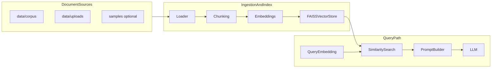
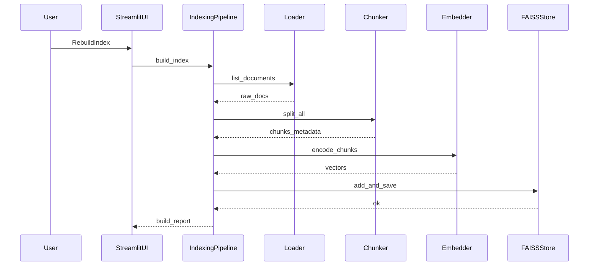
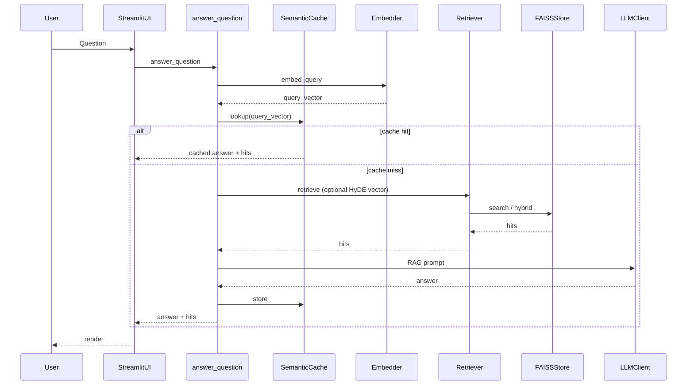

# Architecture

This document describes the **logical** RAG pipeline, **physical** layout on disk, and **module boundaries**. It matches the mental model for **Basic RAG**; **Advanced RAG** adds retrieval and cache layers on the same path (see [phase-roadmap.md](phase-roadmap.md), [advanced-rag.md](advanced-rag.md)).

```text
Document Sources → Loader → Chunking (+ metadata) → Embeddings → FAISS
User Question → Question Embedding → Semantic cache? → HyDE merge (optional) →
Advanced retrieval (dense / BM25 / RRF / rerank; optional chapter filters)
→ Prompt Builder → LLM → Final Response
```

## Design goals

- **Explicit stages**: each step is a small module you can read in isolation.
- **Educational**: you can replace one stage (e.g. chunking strategy) without rewriting the whole app.
- **Evolution**: **Phase 2 (Advanced RAG)** layers hybrid retrieval, reranking, HyDE, filters, and semantic cache on the same boundaries; see [phase-roadmap.md](phase-roadmap.md).

## High-level flow



## Sequence: index build (corpus change → persisted index)

When you add files or click **Rebuild index**, the app re-runs ingestion and overwrites persisted artifacts under `data/index/`.



## Sequence: question answering

Optional steps (**semantic cache**, **HyDE**, **metadata filters**) are implemented in `pipeline/query.py` and `retrieval/`; the diagram below is simplified.



## Module boundaries (Basic + Advanced RAG)

| Module | Responsibility | Inputs | Outputs |
|--------|----------------|--------|---------|
| `rag_assistant.loaders` | Discover and read files (PDF, Markdown, plain text) from corpus and upload directories. | Paths on disk | List of documents with `text` + `metadata["source"]` |
| `rag_assistant.chunking` | Split documents into overlapping chunks; indexing adds path-derived **`metadata`** (e.g. D2L `chapter_*`). | Documents | Chunk records (`text`, `source`, `chunk_index`, `metadata`) |
| `rag_assistant.embeddings` | Turn text into vectors using `sentence-transformers`. | Strings or lists of strings | `numpy` vectors (L2-normalized for cosine-style search) |
| `rag_assistant.vectorstore` | Maintain FAISS index + parallel metadata; save/load from `data/index/`. | Vectors + metadata | Persisted files; `search(query_vector, k)` |
| `rag_assistant.retrieval` | Dense + optional BM25/RRF/rerank; optional **HyDE** vector upstream; optional **chapter filters**. | Question + store + vectors | Ranked hits with `row_id`, scores, optional `metadata` |
| `rag_assistant.cache` | Semantic cache lookup/store (JSON or Redis). | Query embedding + fingerprint tags | `CacheEntry` or miss |
| `rag_assistant.llm` | `LLMClient.generate` (Gemini, OpenAI, or `echo` via `LLM_PROVIDER` / factory). | Prompt string | Model text |
| `rag_assistant.pipeline` | Glue: “build index from disk” and “answer question using loaded index.” | Config paths | Side effects + structured results |
| `app.streamlit_app` | User-facing controls: status, upload, rebuild, chat, show retrieved chunks. | User events | Rendered UI |

**Non-goals in this repo’s scope**: automatic crawling of arbitrary websites at query time, live distributed training orchestration, multi-tenant auth, **and in-repo agent frameworks** (use a separate project for agents).

## Directory layout

```text
rag-assistant/             # suggested checkout folder name
  app/
    streamlit_app.py       # UI entrypoint
  scripts/
    sync_d2l_en.py         # optional D2L corpus sparse clone
  docker-compose.yml       # optional Redis Stack for semantic cache
  src/
    rag_assistant/         # importable package
      config.py
      loaders/
      chunking/
      embeddings/
      vectorstore/
      retrieval/
      cache/
      llm/
      pipeline/
  data/
    corpus/                # your long-lived docs (gitignored)
    uploads/               # files uploaded via UI (gitignored)
    index/                 # FAISS + JSON metadata (gitignored)
    cache/                 # JSON semantic cache when backend=json (gitignored)
  samples/                 # tiny optional checked-in examples
  docs/                    # this documentation
```

## Configuration surface

Phase 1 centralizes tunables in `src/rag_assistant/config.py`: embedding model id, chunk size/overlap, top-k, paths, Gemini/OpenAI model settings, `LLM_PROVIDER`, HyDE, metadata filters, semantic cache backend and Redis settings, retrieval pool sizes. **Only** **API keys** are read from the environment / `.env` (Gemini / Google and/or OpenAI—see [development-setup.md](development-setup.md), [scripts-and-commands.md](scripts-and-commands.md), and [security-and-secrets.md](security-and-secrets.md)).

## Related reading

- [technology-stack.md](technology-stack.md) — Why Streamlit, FAISS, MiniLM, etc.
- [rag-pipeline-deep-dive.md](rag-pipeline-deep-dive.md) — What each stage is really doing.
- [scripts-and-commands.md](scripts-and-commands.md) — Commands and debugging.
- [results-and-verification.md](results-and-verification.md) — Expected UI outcomes.
- [index-persistence.md](index-persistence.md) — Files written under `data/index/`.
