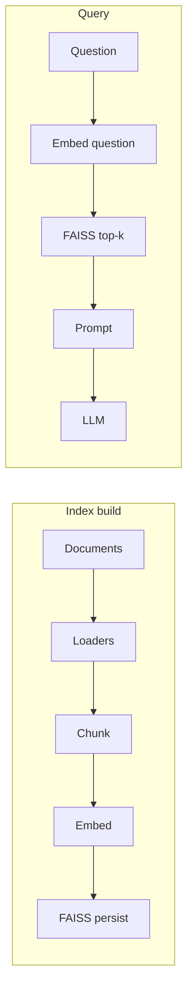
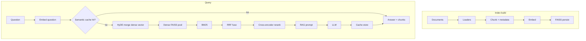

# Phase roadmap (two phases only)

This repo is scoped to **two phases**: **Basic RAG** (conceptual core) and **Advanced RAG** (what this codebase **always runs** at query time). **There are no runtime switches** to turn hybrid retrieval, rerank, HyDE, or semantic cache off—tune numbers and backends in **`src/rag_assistant/config.py`**; only **Gemini / Google API keys** belong in **`.env`**. **Agents** belong in a **different project**.

For **commands, scripts, dependencies, and debugging**, see [scripts-and-commands.md](scripts-and-commands.md) and [results-and-verification.md](results-and-verification.md).

---

## Phase 1 — Basic RAG (mental model)

**What it is** (the smallest story of RAG):

- Ingest **PDF / Markdown / text** from `data/corpus/`, `data/uploads/`, and `samples/`.
- **Chunk** → **embed** → **dense vector search** (FAISS) → **prompt with CONTEXT** → **LLM**.

**In this repository:** the live app **always** adds the Phase 2 layers below after indexing; there is no “basic-only” runtime mode. Use this section to teach or reason about the **dense + prompt + LLM** core that still exists *inside* the advanced pipeline (e.g. after reranking, you still pass **TOP_K** chunks to the same style of prompt).

**Explicit non-goals (this project)**

- No live GPU cluster orchestration from this app.
- No web crawling at query time (you place sources under `data/corpus/` yourself).
- **No agents** in this roadmap.

### Flowchart — Phase 1 (Basic RAG)

---

## Phase 2 — Advanced RAG (**always on** in this repo)

**What the running app does** (see [advanced-rag.md](advanced-rag.md)):

- **Semantic cache** (JSON or Redis per `config.py`) before heavy work.
- **HyDE** — hypothetical passage merged into the **dense** query vector; **BM25** uses the raw question.
- **Dense candidate pool** then **BM25** then **RRF** then **cross-encoder rerank** → final **TOP_K** chunks for the prompt.
- **Chunk `metadata`** for optional **chapter filters** (`METADATA_FILTER_CHAPTERS` list in `config.py`).
- **Fingerprints** so cache entries stay consistent with index + retrieval settings.

**Scripts / infra:** `scripts/sync_d2l_en.py` (optional corpus), `docker-compose.yml` (if `SEMANTIC_CACHE_BACKEND = "redis"`).

### Flowchart — Phase 2 (Advanced RAG)

---

## How to evolve without breaking the two-phase model

1. **Keep retrieval hits stable** — same shape `{text, source, score, row_id, ...}` for the prompt builder and UI.
2. **Version the index** — `index_info.json` records embedding model and chunk params; semantic cache fingerprints include `retrieval_profile_fingerprint()`.
3. **Change behavior in `config.py`** — constants only (plus API keys in `.env`).

## Related reading

- [architecture.md](architecture.md) — Module boundaries.
- [advanced-rag.md](advanced-rag.md) — Stages and `config.py` knobs for Phase 2.
- [technology-stack.md](technology-stack.md) — Libraries.
- [scripts-and-commands.md](scripts-and-commands.md) — Runbook and debug checklist.
