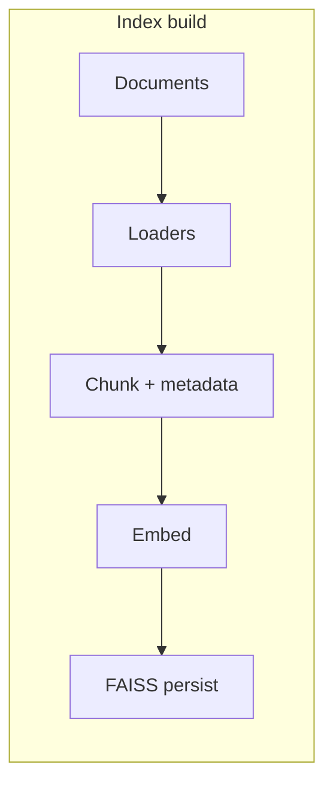
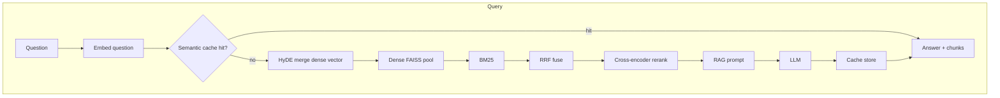

# RAG pipeline overview

This project runs one **end-to-end RAG pipeline**: index documents with **loaders → chunking (with metadata) → embeddings → FAISS**; answer questions with **semantic cache** (possible short-circuit), **HyDE** on the dense query path, **dense + BM25 + RRF + cross-encoder rerank**, then **RAG prompt → LLM**. Tunables live in **`src/rag_assistant/config.py`**; API keys only in **`.env`**.

## Index build

## Query path

## Extensibility

1. **Stable hit shape** — Keep retrieval outputs shaped for the prompt builder and UI (`text`, `source`, `score`, `row_id`, …).
2. **Version the index** — `index_info.json` records embedding model and chunk params; semantic cache uses `retrieval_profile_fingerprint()` so settings stay consistent with stored answers.
3. **Change behavior in `config.py`** — Constants and template version; keys stay in `.env`.

## Out of scope

- In-repo **agent** frameworks and tool-calling orchestration (handle that in a separate codebase if needed).
- **Web crawling** at query time; you supply documents under `data/corpus/` and `data/uploads/`.

**Optional infra:** `scripts/sync_d2l_en.py` (D2L corpus), `docker-compose.yml` (Redis when `SEMANTIC_CACHE_BACKEND = "redis"`).

## Related reading

- [advanced-rag.md](advanced-rag.md) — Stages and `config.py` constants.
- [architecture.md](architecture.md) — Modules and sequence diagrams.
- [technology-stack.md](technology-stack.md) — Libraries.
- [scripts-and-commands.md](scripts-and-commands.md) — Commands and debugging.
