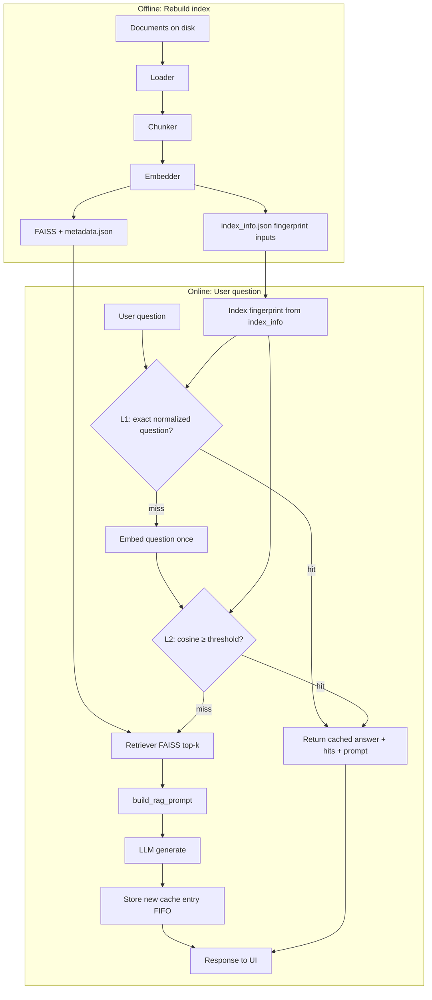

# Semantic caching

The app can **reuse a past answer** when a new question is **semantically close** to one asked before (same embedding space as retrieval). On a hit it skips **FAISS search** and the **main RAG LLM** call, saving latency and API cost. How it fits in the stack: [pipeline-overview.md](pipeline-overview.md).

**Two-tier lookup:** **L1** matches the **normalized question string** (strip, case-fold, collapse whitespace) against stored questions. **L2** uses **cosine similarity** of question embeddings against the configured threshold. The Streamlit UI shows one line per answer, e.g. `cache: exact (L1) · retrieval: 0.0s` or `cache: semantic (L2) · retrieval: 0.0s` or `cache: miss · retrieval: 5.5s` (retrieval time is **FAISS + BM25 + rerank** only, not HyDE or the LLM call).

## Where to set the similarity threshold

Edit the constant **`SEMANTIC_CACHE_SIMILARITY_THRESHOLD`** in **`src/rag_assistant/config.py`** (Python float). Only **API keys** belong in **`.env`** — not cache tuning.

Sample questions and **A/B paraphrase pairs** to exercise the cache: [d2l-sample-questions.md](d2l-sample-questions.md).

## Configuration (`src/rag_assistant/config.py`)

| Constant | See `config.py` | Meaning |
|----------|-----------------|--------|
| `SEMANTIC_CACHE_SIMILARITY_THRESHOLD` | current value in repo | Minimum **cosine similarity** vs a cached question embedding to count as a hit. |
| `SEMANTIC_CACHE_MAX_ENTRIES` | current value in repo | FIFO cap; oldest entries drop when full. |
| `SEMANTIC_CACHE_BACKEND` | `"json"` or `"redis"` | File under `data/cache/` vs Redis ([redis-stack.md](redis-stack.md)). |
| `REDIS_URL` | when using Redis | Connection URL. |
| `REDIS_SEMANTIC_CACHE_KEY_PREFIX` | when using Redis | Namespace for Redis keys. |

Semantic cache is **always on**. If **`SEMANTIC_CACHE_BACKEND = "redis"`** and Redis is unreachable at startup, the app **falls back to the JSON file cache** and logs a warning.

Persisted JSON file (gitignored): `data/cache/semantic_cache.json`.

Redis deployment: use `docker compose up -d` when using the `redis` backend — [redis-stack.md](redis-stack.md).

## Invalidation (when a hit is *not* allowed)

A cache entry only matches if **all** of these agree with the current request:

- **Index fingerprint** — derived from `index_info.json` (`built_at`, `num_chunks`, `embedding_model`, chunk params) plus `PROMPT_TEMPLATE_VERSION` and **`retrieval_profile_fingerprint()`** (includes retrieval numeric settings, **HyDE max chars**, and **metadata filter** list). After **Rebuild index**, the fingerprint changes → old entries are ignored for new questions.
- **LLM identity** — `llm_provider` and `model_label` (e.g. Gemini model id) must match, so switching model does not silently reuse the wrong answer.
- **Prompt template version** — stored on each entry; bump `PROMPT_TEMPLATE_VERSION` in config to invalidate old wording.

Failed LLM calls (`**Could not call LLM...**`) are **not** stored.

## Full pipeline flowchart (with cache)

## Relation to the rest of the stack

Semantic caching sits **around** `answer_question`: same retrieval and LLM stack, with a **short-circuit** when a near-duplicate intent was already answered under the same index and model.

## Related reading

- [scripts-and-commands.md](scripts-and-commands.md) — Commands and `config.py` tuning.
- [architecture.md](architecture.md) — End-to-end RAG shape.
- [redis-stack.md](redis-stack.md) — Docker Compose Redis Stack for the `redis` cache backend.
- [rag-pipeline-deep-dive.md](rag-pipeline-deep-dive.md) — Why normalized vectors imply cosine = dot product.
- [security-and-secrets.md](security-and-secrets.md) — Cached rows contain **question text** and **answers** on disk or in Redis; treat cache storage like sensitive data if queries are sensitive.
