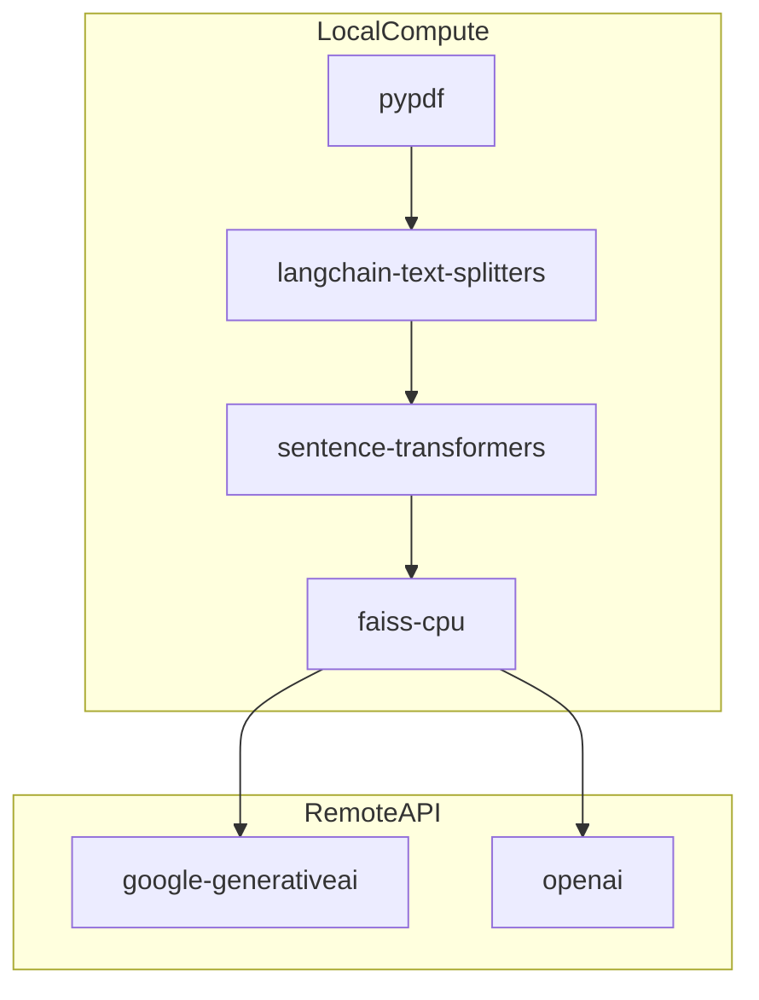

# Technology stack (this repo)

This document records **what** we use for **Basic RAG (Phase 1)** and **Advanced RAG (Phase 2)** in this project, **why** it fits a learning RAG setup, and **what you might swap** later without throwing away the architecture.

## Summary table

| Layer | Choice | Role |
|-------|--------|------|
| Language | Python 3.11+ | Readable ecosystem for ML and glue code. |
| UI | Streamlit | Fast UI for experiments; minimal front-end boilerplate. |
| Embeddings | `sentence-transformers` + `all-MiniLM-L6-v2` | Local CPU-friendly model; good baseline for teaching similarity search. |
| Lexical rank (optional) | `rank-bm25` | BM25Okapi over chunk tokens; fused with dense ranks via RRF. |
| Rerank (optional) | `sentence-transformers` **CrossEncoder** | Second-stage scoring of `(question, chunk)` pairs. |
| Chunking | `langchain-text-splitters` | Battle-tested `RecursiveCharacterTextSplitter`; easy to tune. |
| PDF parsing | `pypdf` | Pure-Python PDF text extraction (successor to the older PyPDF2 line). |
| Paths | `pathlib` | Standard library path handling (clearer than string paths). |
| LLM | **Gemini** (`google-generativeai`) or **OpenAI** (`openai` SDK) via `LLM_PROVIDER` | Swappable `LLMClient`; `echo` for offline checks. See [llm-providers.md](llm-providers.md). |
| HyDE (optional) | Same LLM + embedder | Hypothetical passage merged into **dense** query vector ([advanced-rag.md](advanced-rag.md)). |
| Chapter filters (optional) | Path-derived `metadata` + `config.py` | Restrict BM25 + dense candidates ([advanced-rag.md](advanced-rag.md)). |

> **Note on “PyPDF”**: many tutorials say “PyPDF”; this repo uses the maintained **`pypdf`** package on PyPI. Functionally you still “read PDFs into text” the same way; see [document-ingestion.md](document-ingestion.md).

> **Dependency table:** package-by-package roles and “not in requirements.txt” tools (Git, Docker) live in [scripts-and-commands.md](scripts-and-commands.md#dependencies-python).

## Rationale by component

### Streamlit

- **Pros**: one Python file can expose uploads, buttons, and chat; great for demos and coursework.
- **Cons**: not a production web framework; session and concurrency models are simplistic.

**Alternatives later**: FastAPI + React/Vue if you need auth, scaling, or custom UX.

### sentence-transformers (`all-MiniLM-L6-v2`)

- **Pros**: runs locally; small download; fast on CPU; widely documented for teaching embeddings.
- **Cons**: not the strongest retrieval model for subtle technical questions; English-centric.

**Alternatives later**: `bge-small-en-v1.5`, E5 family, or hosted embedding APIs—usually better quality at the cost of complexity, latency, or money.

### FAISS

- **Pros**: explicit control over index type and distance; easy to persist with `faiss.write_index`; no separate database server.
- **Cons**: you manage metadata yourself (we store a JSON sidecar); advanced filtering is DIY compared to some DBs.

**Alternatives later**:

- **Chroma**, **LanceDB**, **Qdrant**: richer metadata filters, hybrid search integrations, server modes.
- Still worth learning FAISS first: it sharpens your understanding of “vector + id + metadata.”

### langchain-text-splitters

We use only the **splitting** utilities, not a full LangChain “chain,” so the retrieval path stays visible in our own modules.

**Alternatives later**: semantic chunking, structure-aware Markdown splitting, or document-type-specific parsers.

### LLM: Gemini or OpenAI

**Gemini** uses the Google-maintained Python SDK (`google-generativeai`); **OpenAI** uses the official `openai` package and **`OPENAI_MODEL`** in `config.py` (default `gpt-4o-mini`).

**Swapping**: generation goes through `LLMClient` and `build_llm_client()` (`LLM_PROVIDER` in `config.py`: `gemini`, `openai`, or `echo`). Built-in **`echo`** skips the API for local RAG checks. See [llm-providers.md](llm-providers.md) (includes OpenAI model picks).

**Alternatives**: raw REST (more boilerplate), or other providers (Anthropic, etc.) by adding a class under `rag_assistant/llm/` and registering it in the factory.

### pypdf

Good enough for many PDFs; complex layouts (multi-column, heavy figures) may yield noisy text.

**Alternatives later**: `pdfplumber`, `unstructured`, or OCR pipelines for scanned PDFs.

### Advanced retrieval (`rank-bm25` + CrossEncoder)

Default-on **hybrid** search combines dense FAISS neighbors with **BM25** lexical scores using **RRF**, then **reranks** a shortlist with a small **cross-encoder** (see [advanced-rag.md](advanced-rag.md)). This repo runs that stack **always** (no off switch); tune weights and pool sizes in `config.py`.

## Dependency grouping (mental model)

Embeddings and search are **local**; generation is **remote** (Gemini or OpenAI, depending on `LLM_PROVIDER`). That split is common in learning projects: keep retrieval private, pay only for generation.

## Version pinning strategy

`requirements.txt` pins known-good ranges for reproducibility. For a course or lab, you may relax pins—if you do, keep a note of what worked in [troubleshooting.md](troubleshooting.md).

## Related reading

- [rag-pipeline-deep-dive.md](rag-pipeline-deep-dive.md) — How these pieces connect in a query.
- [advanced-rag.md](advanced-rag.md) — Hybrid BM25, RRF, reranking, env flags.
- [phase-roadmap.md](phase-roadmap.md) — **Basic RAG (Phase 1)** vs **Advanced RAG (Phase 2)** only; no agent roadmap here.
